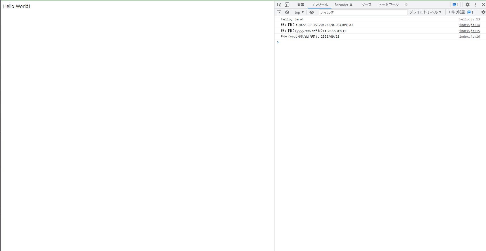

Docker環境テンプレート：node+webpack
====================

<!-- @import "[TOC]" {cmd="toc" depthFrom=1 depthTo=6 orderedList=false} -->

<!-- code_chunk_output -->

- [概要](#概要)
- [環境](#環境)
- [フォルダ構成](#フォルダ構成)
- [使い方](#使い方)
- [実行結果サンプル](#実行結果サンプル)

<!-- /code_chunk_output -->

## 概要

webpackが利用できる開発環境です。

## 環境

| container | バージョン |  ポート  |
| --------- | ---------- | -------- |
| nginx     | latest     | 80 -> 80 |
| node      | slim       | なし     |

## フォルダ構成

```
+ .docker/              ・・・docker関連ファイル格納ディレクトリ
|   + nginx/            ・・・nginx設定
|
+ app/
|   + public/           ・・・Web公開ディレクトリ(ドキュメントルート)
|       + dist/         ・・・バンドルファイルの出力先
|   + src/              ・・・プログラム格納ディレクトリ
|   + node_modules/     ・・・node module格納ディレクトリ(.gitignoreにてgit管理除外)
|   - package.json      ・・・npm設定ファイル
|
- docker-compose.yml
- README.md
```


## 使い方

リポジトリをクローン後, 以下のコマンドを実行してdockerコンテナを起動してください。

```bash
# docker-compose.ymlファイルと同一フォルダ階層で実行
# コンテナが起動する
docker-compose up -d

# node moduleのインストール
docker-compose exec node npm ci

# webpackでバンドル(develop版)
docker-compose exec node npm run build
# webpackでバンドル(production版)
docker-compose exec node npm run prod
```

* コンテナの中で作業する(node)

```bash
# docker-compose.ymlファイルと同一フォルダ階層で実行
# dockerコンテナが起動している状態で実行
docker-compose exec node bash

# コンテナ内でcomposerやlinuxコマンドが実行できる
ls
node -v

# コンテナから抜ける
exit
```

* コンテナの停止方法

```bash
# docker-compose.ymlファイルと同一フォルダ階層で実行
docker-compose down
```

## 実行結果サンプル

`http://localhost/`にアクセスし、ブラウザのデベロッパーツールにて確認。


